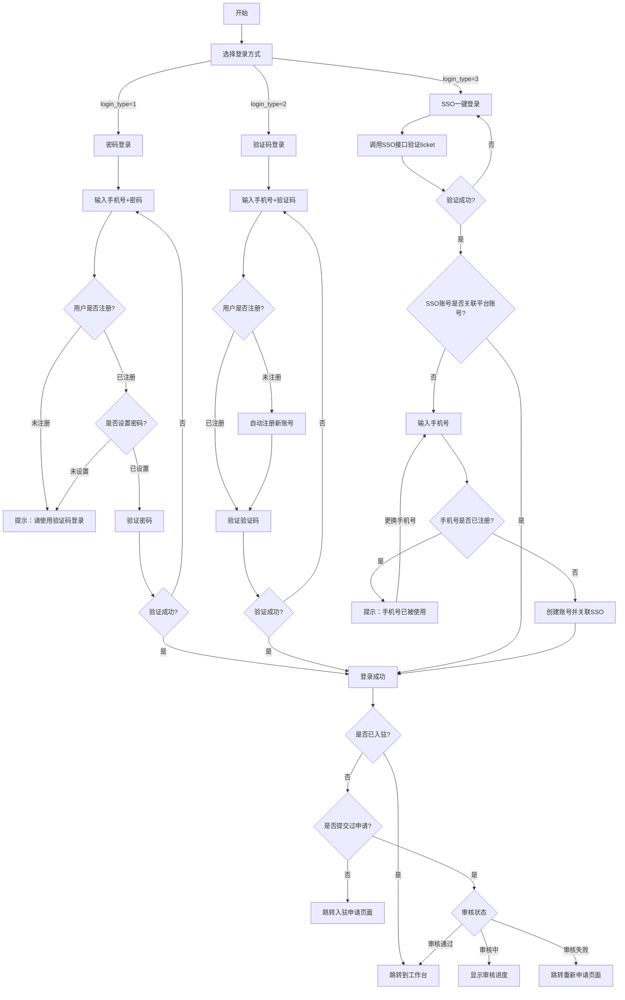

# CloundPhone

## Done List
- 文件上传
  - 个人头像
- 账户注册
  - 手机号+验证码
- 账户注销
- 账户登录
  - 手机号+验证码
  - 手机号+密码
- 个人信息管理
  - 获取个人信息
  - 个人信息编辑
    - 头像
    - 昵称
    - 性别
    - 生日
    - 地区    
- 绑定手机号
  - 验证码发送、校验
- 换绑手机号
  - 验证码发送、校验  
- 修改密码
  - 验证码发送/校验
  - 重置新密码
- 个人实名认证
  - 身份证号
  - 加密、脱敏

## TODO List
- 修改密码后
  - 应该清除之前的访问令牌
  - 并发送WebSocket消息，强制退出。

## 登录设备管理
- 登录时，记录设备相关信息
  - 仅client_type为android、ios时记录，web不记录
  - 如果不存在设备记录，则插入。
  - 如果已经存在设备记录，则更新、
- 提供接口，查询用户历史登录设备记录。
- 提供接口，根据设备ID删除历史登录记录。

### 登录接口
- 客户端类型
- 服务协议

### 部门账户管理
- 新增部门用户
- 部门用户列表
- 权限控制

## Done List
- 实现登录接口: 手机号+密码、手机号+验证码、SSO+ticket
    - 验证码生成、发送、验证
    - SSO接口对接
- 实现令牌内省接口

## TODO List
- 角色体系设计(登录平台后，选择入住服务类型)
    - 服务提供商
    - 商户
- 权限
    - 组织：一个服务提供商就是一个组织

## 业务描述
- Web管理后台，需要满足以下不同类型账户的使用: 通过RBAC来实现
    - 平台管理方
        - 管理游戏模块
        - 管理展会模块
    - 展会-服务提供商
    - 展会-展商

## 登录逻辑
- 四种登录方式
  - 手机号+密码
    - login_type = 1
    - 如果是未注册用户，提示其只能通过手机验证码登录。
    - 如果是已注册用户，但没设置密码，提示其只能通过手机验证码登录。
    - 如果是已注册用户，验证其手机号、密码是否匹配。
  - 手机号+验证码
    - login_type = 2
    - 如果是未注册用户，自动注册。
    - 如果是已注册用户，验证手机验证码是否正确。
  - IUQU账户一键登录(仅供移动端使用)
    - login_type = 3
    - SSO接口完成后，自动注册用户。
  - 账户名+密码登录
    - 仅在本平台验证。

- 登录平台后，检测当前帐户是否已经入驻
  - 如果已经入驻，跳转到对应的工作台页面。
  - 如果没有入驻完成
    - 没有填写申请信息，跳转到入驻申请页面
    - 已经申请，但是还在审核中，显示审核进度
